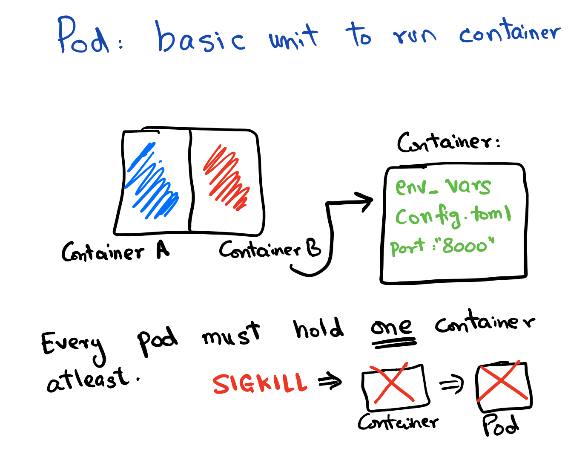
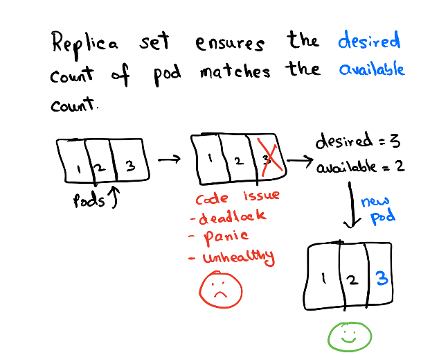
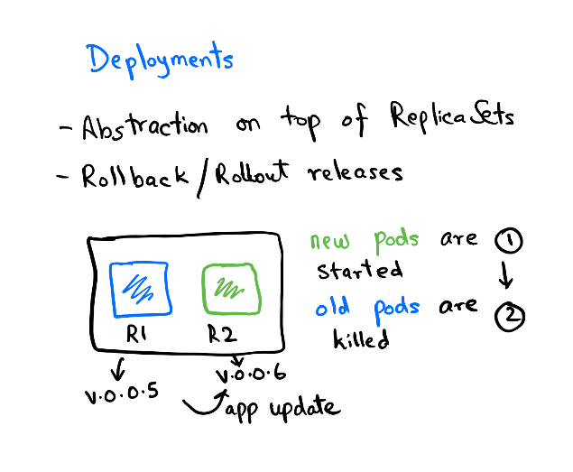

# Understanding kubekutr config

Let's create a folder `listmonk-infra` to store all our manifest configuration files. We will use this as a base folder for the rest of the guide unless specified otherwise.

```shell
mkdir listmonk-infra && cd listmonk-infra
```

`kubekutr` needs to be configured with its own configuration file. To make things easier for newcomers, we have a default configuration template that can be edited according to your needs.

```shell
kubekutr init --default
```

You should see `kubekutr.yml` generated by `kubekutr` in the previous step. Let's edit the file with the below configuration suited for `listmonk`:

```yml
workloads:
  - name: listmonk # name of the project
    deployments:
      - name: app # name of the individual component
        replicas: 1
        labels:
          - name: 'app.kubernetes.io/component: app'
        containers:
          - name: app
            createService: true
            image: 'localhost:32000/listmonk:0.5'
            command: '["./listmonk"]'
            args: '["--config", "/etc/listmonk/config.toml"]'
            envSecret: app-secrets
            ports:
            - name: app-port
              port: 9000
            cpuLimits: 800m
            memoryLimits: 500Mi
            cpuRequests: 400m
            memoryRequests: 250Mi
            readinessPort: 9000
            readinessPath: /
            livenessPort: 9000
            livenessPath: /
            volumeMounts:
              - name: config-dir
                mountPath: /etc/listmonk
        volumes:
          - name: config-dir
    services:
      - name: postgres
        type: ClusterIP
        headless: true
        ports:
          - name: db-port
            targetPort: db-port
            port: 5432
        labels:
          - name: 'app.kubernetes.io/component: svc-headless'
        selectors:
          - name: 'app.kubernetes.io/component: db'
    statefulsets:
      - name: db
        serviceName: postgres
        labels:
          - name: 'app.kubernetes.io/component: db'
        containers:
          - name: postgres
            image: 'postgres:12.2-alpine'
            ports:
            - name: db-port
              port: 5432
            envSecret: db-secrets
            volumeMounts:
              - name: postgres-storage
                mountPath: /var/lib/postgres
            cpuLimits: 500m
            memoryLimits: 800Mi
            cpuRequests: 250m
            memoryRequests: 400Mi
        volumes:
          - name: postgres-storage
```

## A quick overview

Let's break down the giant config into pieces easy to understand.

### workloads

`Workload` represents a project/application. All of the different components of an application together form one workload.

So when we use:

```yml
workloads:
  - name: listmonk # name of the project
  ...
```

We are naming our workload `listmonk` and going to add different components like the app container, the db container, etc to it.

### deployments

Before we describe Deployments object, let's first understand how Kubernetes schedules the containers. Kubernetes control plane runs a component [kube-scheduler](https://kubernetes.io/docs/concepts/scheduling/kube-scheduler/#kube-scheduler). The job of this scheduler is to talk to an agent running on different nodes (called `kubelet`) and figure out which node is the best to run your container depending on resource requirements.

A container in Kubernetes is basically wrapped around something called **Pods**. So Pods contain the information about network, storage resources, volume mounts, and the Docker image/arg etc. Kubernetes manages the pod directly, not the container so any changes that the controller makes are applied at the Pod level.

> **Sidecars**: Running a single container per pod is the most common use case, but you often may find the usage of sidecars, which means running a lightweight container in addition to your application. Multiple containers together also form one Pod. The most common use cases of sidecar are for running logging/monitoring agents or running a lightweight web proxy etc.



Pods are managed by **Replica Set**. Replica set controls the rollout/rollback of a group of pods. You can configure the rollout pattern by tweaking the `RollingUpdateStrategy` spec in `Deployment`.



The deployment contains the history of Replica sets at any point in time. The Deployment Controller changes the actual state to the desired state if there's any drift noticed.



### services

**Service** object is used to expose your pod to other pods or to the world. There are multiple services types available for different use-cases about which you can read more [here](https://kubernetes.io/docs/concepts/services-networking/service/).


In this guide, we will use the service of type **ClusterIP**. Each pod exposes an IP on the cluster and there are various ways to connect this IP. But what happens if you run multiple replicas of one app? You cannot expect the client to remember _n IPs_ for _n replicas_. So, when you create a `Service` object of `ClusterIP` you get a virtual IP. This Service object backs all other IPs in the form of another object called **Endpoints**. The endpoint object is responsible for keeping a track of all Pod IPs that the Service object connects to. Kubernetes runs a component `kube-proxy` which resolves the virtual IP to the actual Pod IP present in `Endpoints`. This selection is **not** round-robin and completely random so it is very much possible that you see skewed traffic across pods.

Another crucial concept in service is **Labels** & **Selectors**. While reading the above paragraph if you were thinking how does the Service object know which Pod IP to track, then the answer lies in using the field `.spec.selector` of the Service object.

To understand this easily, let's imagine our Deployment spec looks like:

```yml
name: listmonk
replicas: 1
...
labels:
app: listmonk
tier: web
...
image: listmonk:latest
```

Now, to target the Pod with **labels** `app:listmonk` and `tier:web` we need to create a `Service` object which matches the `.spec.selector`:

```yml
selector:
    app: listmonk
    tier: web
```

So, this is how using Labels and matching the equivalent values with Selectors we can target the Pods from a Service object.


Now that we have covered the broader concepts, let's start building the base manifest using `kubekutr` [here](./03_02_generate_base.md).
