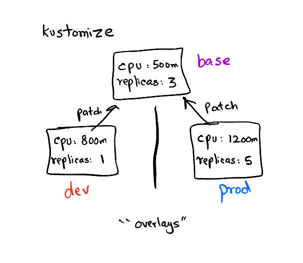

# Kustomize the Manifests

So far we have learned how to use `kubekutr` to write our base manifest files. We will need `kustomize` to _customize_ the base YAML files generated by `kubekutr` in a template-free format.

## Why Kustomize

In the previous section, we explored `kubekutr` to create manifests from scratch. However, when we do deployments across multiple environments there are cases where some things need to be changed based on the environment. For eg, in a local K8s cluster, since there's no cloud provisioner to create a `LoadBalancer` service, we need to change it to a `ClusterIP` or `NodePort`. Or if you've configured to run `10 replica`s of your pod to serve high traffic with higher resource limits, but you need to change these variables in a local setup.



**kustomize** helps us with that in a template-free manner. There are no ugly _if-else_ in our templates (conditionals in templates are _bad_) which also makes the output of these templates as K8s _native_. `kustomize` takes the approach where we basically combine the **base** and apply **patch** to create a **variant**.

For eg, we created `base` using `kubekutr` which provides a starting point for any further configurations. Then based on the environment (`dev/staging/prod`) we create **overalys**. In these overalys, we again specify the things to be changed referencing a base called **patches**. The changes are applied on top of the base and the resultant output is called a **variant**. So if we create 3 overlays referencing the same base we get 3 variants to deploy based on the environment. This approach helps us to keep the base as clean as possible and only fiddle with the values that change across environments.

Let's proceed to write our first `kustomization.yml` file!

## Create kustomization.yml file

Create a file `kustomization.yml` which represents the config for `kustomize` to build resources etc.

```shell
# vim base/kustomization.yml
resources:
- listmonk/app-deployment.yml
- listmonk/app-service.yml
- listmonk/db-statefulset.yml
- listmonk/postgres-service.yml
```

First, we'll collect the resources used to build our base. These files are generated by `kubekutr` and we are just aggregating the resources so that when `kustomize build` runs, it parses all of these resources.

> **Note**: As mentioned earlier, `kustomize` targets the root of the directory where `kustomization.yaml` is present.

You can see the manifest generated with:

```shell
kustomize build base
```

Now that we have built our _inventory_ for the resources required to deploy _listmonk_, let's proceed to create an **overlay** for our base deployment [here](./04_01_Kustomize_Overlays.md).
