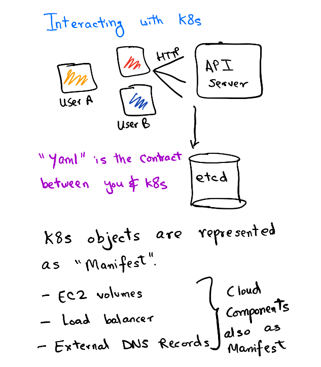

# Deploying on microk8s

Now that the preflight changes have been done, let's take a look at how we will deploy to `microK8s`.

Kubernetes has an API server deployed in its control plane. This API server is responsible for making changes in the cluster. The API server is like the gateway to your cluster and all the updates can be managed with this. `kubectl` is a nifty wrapper for making HTTP calls to this API. In this section, we'll see how we declaratively `apply` changes to our cluster to get our app running.



## Step 1: Create a namespace

We need to create a namespace object. `Namespace` refers to a virtual cluster in Kubernetes. Since Kubernetes is a multi-tenant platform where multiple workloads are deployed, we need a layer of separation. Namespace acts as a virtual separation but remembers it does **not** mean isolation in terms of scheduling. You can set resource limits to a namespace, manage all the resources of an app collectively with one namespace, set network policies on the namespace, etc, set proper RBAC for teams to access a particular Namespace and restrict their actions as well.

> **Note**: If you don't specify any namespace, `default` namespace is used. In production clusters, this is a *very* bad idea as you don't want to mix arbitrary workloads under one namespace.

```yml
# vim overlays/local/namespace.yml
apiVersion: v1
kind: Namespace
metadata:
  name: listmonk-local
```

```shell
# cwd listmonk-base-deployment
microk8s.kubectl apply -f overlays/local/namespace.yml
```

A namespace should have been created with the name **listmonk-local**. You can verify the same if it's created by:

```shell
microk8s.kubectl get namespace
```

### Step 2: Build and apply manifest

```shell
kustomize build overlays/local | microk8s.kubectl apply -f -
```

The resources are now applied in the cluster. You can see the status of pods by:

```shell
$ microk8s.kubectl get pods -n listmonk-local
NAME                       READY   STATUS    RESTARTS   AGE
api-dev-5954dbc8fb-2242w   1/1     Running   0          4d
api-dev-5954dbc8fb-99vwx   1/1     Running   0          4d
api-dev-5954dbc8fb-nbm7j   1/1     Running   0          4d
```

### Step 3: Verifying the changes

#### Get the pod status

```shell
microk8s.kubectl get pods -n listmonk-local
```

#### Get deployment logs

```shell
microk8s.kubectl logs deployment/listmonk-app-local -n listmonk-local

2020/03/28 09:36:12 main.go:89: reading config: /etc/listmonk/config.toml
2020/03/28 09:36:13 init.go:209: loaded SMTP: my0 (xxxxx@my.smtp.server)
2020/03/28 09:36:13 init.go:197: skipped SMTP: postal
⇨ http server started on [::]:9000
```

Yay! We can see `listmonk` is running successfully in the logs.

#### Get Service details

```shell
microk8s.kubectl get service -n listmonk-local
```

> **Note**: It's important to use `--namespace/-n` flag with every `kubectl` command **if** you don't set the namespace in your `current-context`. By default, the `default` namespace is set in the `current-context`, so you can set it to `listmonk-local` to avoid passing the flag `-n` for your convenience too.

### Further Steps

You can explore other `kubectl` commands [here](https://kubernetes.io/docs/reference/kubectl/cheatsheet/).

Head over to read the [final note](./06_00_Final_word.md).
